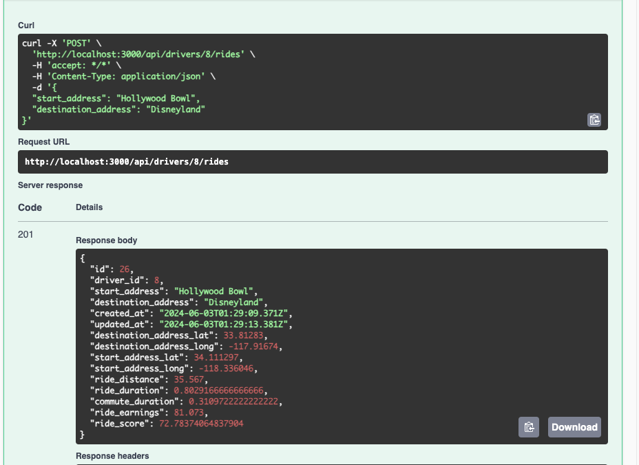
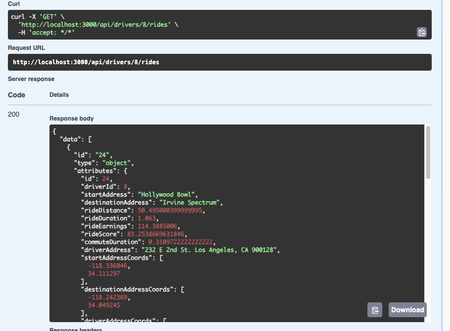
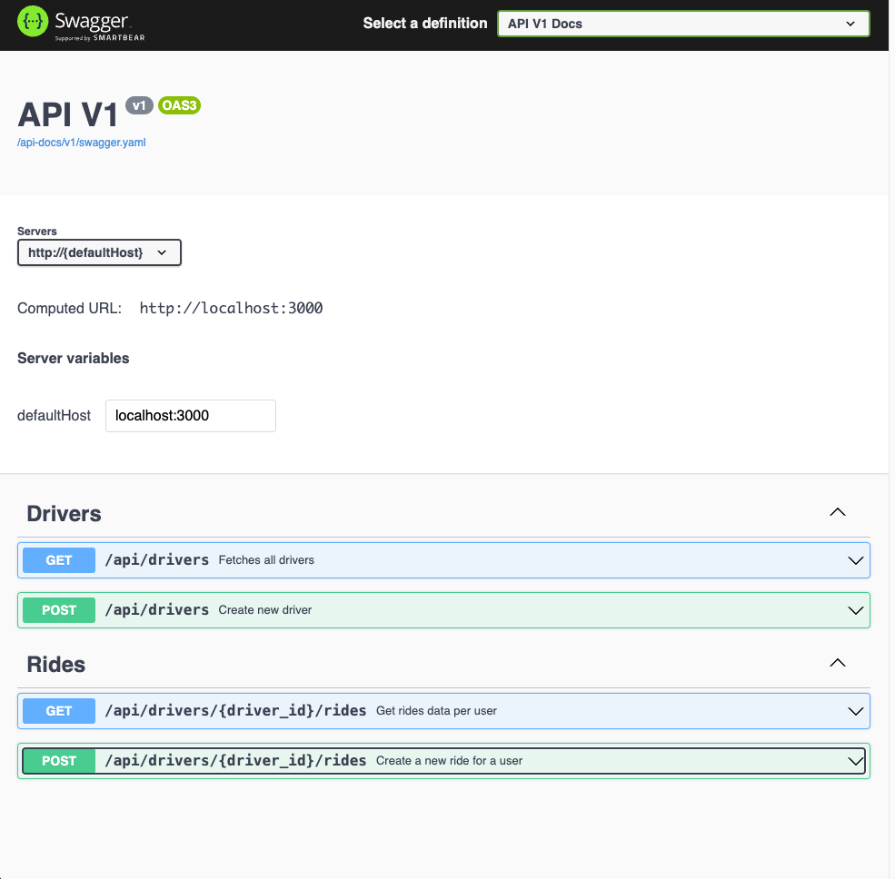

# Ride Service API

Ride Service API that return ride data per driver in JSON format.

## Table of Contents
- [Architecture and Code Structure](#architecture-and-code-structure)
  - Project Overview
  - Key Design Decisions
- [Dependencies](#dependencies)
  - Environment Variables
  - Running the Test Suite and Generating Swagger Documentation
  - Starting the Application
  - Testing the API Endpoints
  - [Database Creation & Initialization](#database-creation--initialization)
- [Testing the API Endpoints](#testing-the-api-endpoints)
  - Swagger API Documentations
  - Sample API Responses


## Architecture and Code Structure
### Overview
The primary objective of this API application is to provide a way for a user/driver in this case, the ability to create a ride, and receive estimated costs and ride score information. Upon a driver creating a ride, the ride data will be used to reach an external Mapping/Direction API so that calculations are made and displayed for the driver.

### Architecture
The architecture of the Ride Service API is designed to separate concerns, modularity and encapusulate external api logic into service objects/clases. It's built using a Ruby on Rails framework and postgreSQL database. I am using the [Open Route Service API](https://api.openrouteservice.org) as it is free, opensource, and simple to use.

1. Separation of Concerns:
As one of the SOLID Principles, I focused on creating simple classes that are focused on one task, so that it is easily updated without need to update its dependencies.
Ultimately, if I decide to change the formulas for metric calculation, or change the geocode api, or even the search api, any changes should have minimal impact on their own classes.

2. Service-Oriented Approach: 
Adding such services such as `MetricsCalculationService` and `RouteRequestService` encapsulate the business logic related to API and handling ride calculation. This approach was to keep controllers small and my models focused on database inquiries, validations, associations, and scopes.

### Key Design Decisions
1. **Use of openrouteservice API**: The openrouteservice API was chosen for geocoding and directions data because it's opensourced and free.
2. **Rswag for API Documentation**: Rswag was chosen for API documention as it creates a nice UI that anyone can test api calls on. 
3. **Use of httparty**: Use this package to add layer to the external sources. I created `DirectionService` and others as a wrapper so I can easily change to a different provider.
4. **Callbacks**: I decied not to use any callback, or geocoder gem as I find it hard to debug and test. In the future I can use a worker to handle processing the api so that it is not blocking during a creation. In addition, I can wrap everything in a transaction to rollback if the api fails.

### Code Structure
1. Controllers:
  - `DriversController`: 
  - `RidesController`:
2. Models:
  - `Driver`: Storing the driver geocode information, validation, and have a many association with ride
  - `Ride`: Storing rider/geocode information and calculations.
3. Services:
  - `RouteRequest`: Wrapper class around the OpenRouteService API and Httparty Library
  - `ProcessorServices`: Service class responsible for handling any operations needed after a ride/driver creation.
  - `DirectionService/GeocodeServices`: Service class responsible for preparing and postmortem api calls, 
  - `MetricsCalculationService`: Service class responsible for making calculations such as ride_earnings and ride_score.

4. Helpers:
  - `ConversionHelper`: Utiilty module for converting between different units. (meters to miles, seconds to hours, etc.)

## Dependencies
* Ruby version 3.1.2
* Rails version 7.0.4

### Database creation & initialization
```
rails db:prepare
```

### System dependencies
```
 bundle install
```

### Environment Variables
```
cp .env.sample .env
```
> Go to [openrouteservice API](https://api.openrouteservice.org) and generate an api key and add the openroute api key to the .env file

### Initialize Rswag and generate Swagger Documentation
```
rails g rswag:install # Initialize Rswag
```

### Run the api specs and generate the documentation
```
rails rswag
```
> This will generate [RSwag](https://github.com/rswag/rswag) to create API Documentation for api endpoints using [Swagger and OpenAPI](https://swagger.io/)


### Run the basic suite of unit specs.
```
 bundle exec rspec spec 
```

## Start the application
```bash
 rails server
```

##  Testing the API Endpoints
> head to [http://localhost:3000/api-docs/index.html](http://localhost:3000/api-docs/index.html)
1. Create a driver with the POST /api/drivers, ensuring a `home_address` is pass in the body
2. With the new driver `id`, create a new ride with `id` as a query parameter, and
```
{
  "start_address": "Hollywood Bowl",
  "destination_address": "Disneyland"
}
```
3. Fetch all the ride data for a driver using the `GET /api/drivers{driver_id}/rides` endpoint
4. Verify that all the ride data info are populated

## Swagger Sample Responses
### Ride Creation

### Rides Index

### Swagger Docs

